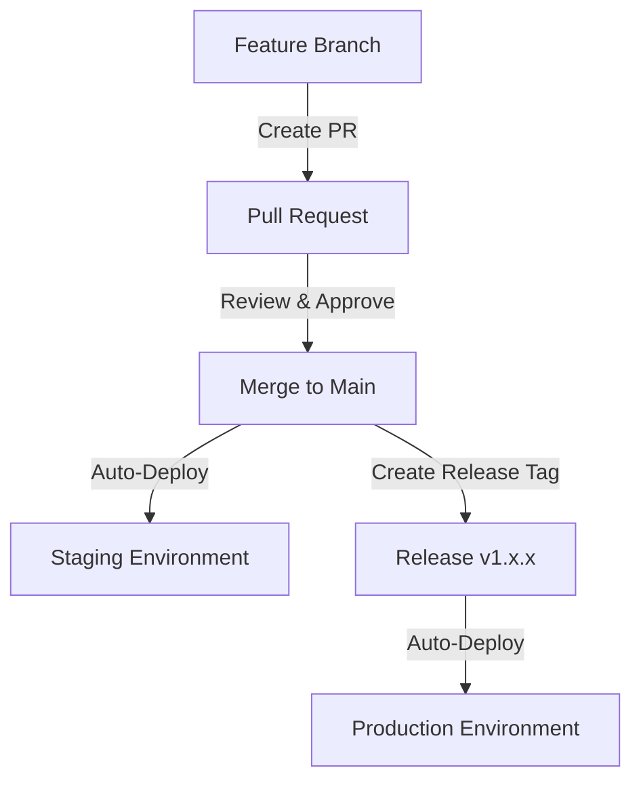

# Infrastructure Development & Deployment Guide

Welcome to our infrastructure codebase! This guide will help you get set up and understand how we manage our infrastructure using Terraform and GitHub Actions. We use Infrastructure as Code (IaC) principles to maintain consistent and reliable deployments across environments.

## Table of Contents

1. [Getting Started](#getting-started)
2. [Project Structure](#project-structure)
3. [Local Development Environment](#local-development-environment)
4. [Deployment Workflow](#deployment-workflow)
5. [GitHub Actions CI/CD Pipeline](#github-actions-cicd-pipeline)
6. [Working with Terraform](#working-with-terraform)
7. [Secrets Management](#secrets-management)
8. [Testing Strategy](#testing-strategy)
9. [Troubleshooting](#troubleshooting)

## Getting Started

### Prerequisites

- [AWS CLI](https://aws.amazon.com/cli/) installed and configured
- [Terraform](https://www.terraform.io/downloads.html) v1.0.1 installed
- [Go](https://golang.org/dl/) 1.15.5+ installed (for Terratest)
- AWS account access with appropriate permissions
- GitHub access to this repository

### Initial Setup

1. Clone the repository:

```bash
git clone <repository-url>
cd <repository-directory>
```

2. Configure your AWS credentials locally:

```bash
aws configure
# Enter your AWS Access Key ID, Secret Access Key, and preferred region (default: us-east-1)
```

3. Install the required tools:

```bash
# Install Terraform
wget https://releases.hashicorp.com/terraform/1.0.1/terraform_1.0.1_linux_amd64.zip
unzip terraform_1.0.1_linux_amd64.zip
sudo mv terraform /usr/local/bin/

# Verify installation
terraform version

# Install Go (for Terratest)
wget https://golang.org/dl/go1.15.5.linux-amd64.tar.gz
sudo tar -C /usr/local -xzf go1.15.5.linux-amd64.tar.gz
echo 'export PATH=$PATH:/usr/local/go/bin' >> ~/.bashrc
source ~/.bashrc

# Verify Go installation
go version
```

## Project Structure

Our infrastructure is organized into distinct environments:

```
.
├── global/         # Resources shared across all environments (e.g., DNS, IAM)
├── staging/        # Staging environment configuration
├── production/     # Production environment configuration
└── tests/
    └── terratest/  # Infrastructure tests using Terratest
```

Each environment directory contains Terraform configurations specific to that environment.

## Local Development Environment

### Initialize and Plan Changes

Always work in a feature branch when making changes:

```bash
# Create a new branch
git checkout -b feature/my-infrastructure-update

# Navigate to the environment you're working with
cd staging

# Initialize Terraform
terraform init

# Format your code
terraform fmt -recursive

# Validate your code
terraform validate

# Create a plan to review changes
terraform plan -out=tfplan
```

### Local Secrets for Development

For local development, you can create a `terraform.tfvars` file to provide required variables:

```terraform
# staging/terraform.tfvars - DO NOT COMMIT THIS FILE
db_instance_type = "db.t3.small"
app_instance_count = 2
# other variables as needed
```

Add `*.tfvars` to your `.gitignore` file to prevent accidental commits of secrets.

## Deployment Workflow

Our deployment workflow follows GitOps principles:

1. **Development**: Changes are made in feature branches
2. **Pull Request**: Changes are reviewed through GitHub PRs
3. **Staging Deployment**: Merges to `main` branch deploy to staging
4. **Production Deployment**: Creating a versioned release tag deploys to production



## GitHub Actions CI/CD Pipeline

Our CI/CD pipeline is defined in `.github/workflows/terraform.yml` and handles:

1. **Validation**: Format checks and plan generation
2. **Testing**: Running Terratest
3. **Deployment**: Applying changes to the appropriate environment

### Workflow Triggers

- **Pull Requests**: Runs validation and testing, generates a plan
- **Push to main**: Deploys to staging
- **Release published**: Deploys to production

### Environment Determination

The workflow automatically determines the environment based on the Git context:

```bash
if [[ $GITHUB_REF =~ ^refs/tags/v[0-9]+\.[0-9]+\.[0-9]+$ ]]; then 
  # Release tag (v1.2.3) - deploy to production
  ENVIRONMENT=production
  ENVIRONMENT_PATH=production
elif [[ $GITHUB_REF == 'refs/heads/main' ]]; then 
  # Main branch - deploy to staging
  ENVIRONMENT=staging
  ENVIRONMENT_PATH=staging
else 
  # Feature branch - use staging config for verification
  ENVIRONMENT=development
  ENVIRONMENT_PATH=staging
fi
```

## Working with Terraform

### Module Structure Example

Here's an example of how you might structure a module in this project:

```terraform
# staging/main.tf
provider "aws" {
  region = var.aws_region
}

module "vpc" {
  source = "../modules/vpc"
  
  cidr_block = var.vpc_cidr
  environment = "staging"
}

module "database" {
  source = "../modules/database"
  
  instance_type = var.db_instance_type
  vpc_id = module.vpc.vpc_id
  subnet_ids = module.vpc.private_subnet_ids
}

# Additional modules as needed
```

### Common Terraform Commands

```bash
# Initialize the working directory
terraform init

# Check formatting
terraform fmt -check -recursive

# Validate the configuration
terraform validate

# See what changes will be made
terraform plan

# Apply changes
terraform apply

# Destroy resources
terraform destroy

# Show current state
terraform show

# List resources in state
terraform state list
```

## Secrets Management

We use AWS Secrets Manager to store and manage environment-specific secrets.

### Secret Structure

Secrets are stored in AWS Secrets Manager using the prefix `terraform/{environment}`, for example:
- `terraform/staging`  
- `terraform/production`

Each secret is a JSON object with key-value pairs:

```json
{
  "db_password": "secure-password-here",
  "api_key": "api-key-value",
  "other_secret": "value"
}
```

### Accessing Secrets in Terraform

Secrets are automatically injected as Terraform variables by the GitHub Actions workflow. In your Terraform code, you can reference them directly:

```terraform
resource "aws_db_instance" "main" {
  // ... other configuration ...
  password = var.db_password  # Injected from AWS Secrets Manager
}
```

### Adding a New Secret

To add a new secret:

```bash
# Format for staging
aws secretsmanager update-secret --secret-id terraform/staging --secret-string '{"db_password":"value","new_secret":"new_value"}'

# Format for production
aws secretsmanager update-secret --secret-id terraform/production --secret-string '{"db_password":"value","new_secret":"new_value"}'
```

## Testing Strategy

We use [Terratest](https://terratest.gruntwork.io/) to validate our infrastructure code. Test files are located in the `tests/terratest` directory.

### Example Terratest

```go
// tests/terratest/vpc_test.go
package test

import (
  "testing"
  "github.com/gruntwork-io/terratest/modules/terraform"
  "github.com/stretchr/testify/assert"
)

func TestVpcModule(t *testing.T) {
  terraformOptions := terraform.WithDefaultRetryableErrors(t, &terraform.Options{
    TerraformDir: "../../staging",
    Vars: map[string]interface{}{
      "vpc_cidr": "10.0.0.0/16",
    },
  })

  defer terraform.Destroy(t, terraformOptions)
  terraform.InitAndApply(t, terraformOptions)

  vpcId := terraform.Output(t, terraformOptions, "vpc_id")
  assert.NotEmpty(t, vpcId, "VPC ID should not be empty")
}
```

### Running Tests Locally

```bash
cd tests/terratest
go test -v -timeout 10m
```

## Troubleshooting

### Common Issues and Solutions

#### Terraform Init Fails

```
Error: Failed to get existing workspaces: workspace "staging" not found
```

**Solution**: Check your AWS credentials and region settings. Make sure you have access to the S3 bucket for Terraform state.

```bash
aws s3 ls s3://your-terraform-state-bucket
```

#### Terraform Apply Fails with Permission Errors

```
Error: Error applying plan: Error creating X: AccessDenied: User: X is not authorized to perform: X
```

**Solution**: Check your IAM permissions. You may need additional IAM roles or policies.

```bash
# List your current IAM permissions
aws iam get-user
aws iam list-attached-user-policies --user-name your-username
```

#### GitHub Actions Workflow Fails

Review the workflow logs to identify the specific error. Common issues include:

1. **Missing Secrets**: Ensure all required GitHub secrets are configured:
   - `AWS_ACCESS_KEY_ID`
   - `AWS_SECRET_ACCESS_KEY`
   - `AWS_REGION` (optional, defaults to us-east-1)

2. **Terraform Plan Errors**: Check the plan output in the PR comment for specific resource errors.

3. **Terratest Failures**: Check the test output for failing assertions.

### Getting Help

If you're still stuck after trying the troubleshooting steps:

1. Check the AWS documentation for specific service errors
2. Review the Terraform registry documentation for modules being used
3. Reach out to the team on Slack in the #infrastructure channel

## Conclusion

This infrastructure is designed to provide a consistent, repeatable deployment process across environments. By following GitOps principles and using infrastructure as code, we maintain reliability and enable collaboration.

For specific questions about the architecture or implementation details that aren't covered here, please reach out to the infrastructure team.
